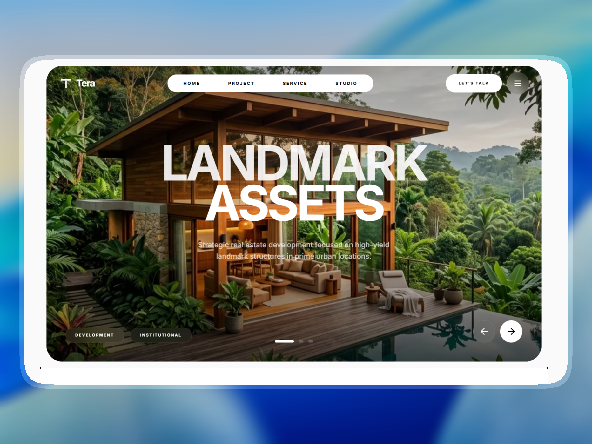

# 🚀 Tera Landing Page
> **Day 5/30 of the "Building 1 AI-Generated Landing Page Every Day" Challenge**



## 🚀 About

Conceptual landing page for **Tera**, a **premium modern architecture agency for landmark structures**, developed with **Next.js 16**, **TypeScript**, and **Tailwind CSS 4**. This project is the fifth realization of an ambitious challenge: creating **1 complete and functional mockup per day using AI**.

Tera is designed for founders, developers, and institutions commissioning visible modern architecture. The goal is to instantly convey **rigor**, **prestige**, **structural innovation**, and **public presence** through a glassy, grid-led, high-end aesthetic.

Live URL: [https://tera-landing.adrielzimbril.com](https://tera-landing.adrielzimbril.com)

## 🎨 Design & Aesthetic Decisions (The "Why")

For this fifth day, the chosen theme revolves around **premium architecture, landmark commissions, innovative structures, and project narrative**.

- **Brutalist Structural Frame:** The interface uses a sharp architectural field, high-contrast panels, strict borders, and a full-bleed grid to feel technical, premium, and spatial.
- **Project-Led Signal:** The flagship concepts appear immediately as the hero proof point so the agency promise is visible before it is explained.
- **Purposeful Interaction:** Interactive cards simulate site reading, massing, facade resolution, stakeholder review, and project telemetry. Motion supports the studio story instead of decorating the page.
- **High-End Agency Rhythm:** The layout uses a floating navigation, bento-style studio panels, architectural project gallery, and a modern footer to communicate a premium commission-focused agency.
- **Architecture Brand Mark:** The favicon and site logo use a compact building mark, tying the identity to structure, facade, and landmark design.

## 🧩 Key Sections

- **🌟 Hero Header:** Designed to grab attention with large premium typography, a floating navigation, and an interactive project slider that cycles through landmark architectural works.
- **🖼️ Project Index:** A responsive architectural gallery showing facade, massing, public edge, and landmark project signals with smooth transitions.
- **🧠 Interactive Studio Bento:** Simulates an architecture studio dashboard with selectable commissions, design phases, project telemetry, and massing studies built around useful interaction.
- **🏗️ Engagement System:** Four architecture service tiers from early concept to full landmark commission, focusing on structural innovation.
- **🏢 Modern Footer:** A restrained brand close with contact routes, project links, social proof language, and a polished final conversion area.

## 🛠️ Tech Stack

This mockup was built with cutting-edge technologies from the React ecosystem:

- **[Next.js 16](https://nextjs.org/)** (App Router)
- **[React 19](https://react.dev/)**
- **TypeScript** for scalable component architecture and safer iteration.
- **[Tailwind CSS v4](https://tailwindcss.com/)** for design tokens, utilities, and modern CSS support.
- **[Motion/React](https://motion.dev/)** for high-performance architectural transitions and layouts.
- **[Lucide React](https://lucide.dev/)** for clean, consistent iconography.
- **Next Font** with **Hanken Grotesk** and **Inter** for optimized display typography.

## 🚀 Quick Start

```bash
# Install dependencies
pnpm install

# Run development server
pnpm dev
```

Open [http://localhost:3000](http://localhost:3000) in your browser to see the result.

## 🌌 Let's meet in space (or on Earth) 🚀

I'm always happy to discuss new projects, collaborations, or simply exchange creative ideas. Here's how to contact me:

- **📧 Email**: [hello@adrielzimbril.com](mailto:hello@adrielzimbril.com)
- **🌐 Website**: [https://www.adrielzimbril.com](https://www.adrielzimbril.com)
- **🐦 Twitter**: [https://twitter.com/adrielzimbril](https://twitter.com/adrielzimbril)
- **💼 LinkedIn**: [https://www.linkedin.com/in/adrielzimbrilcode](https://www.linkedin.com/in/adrielzimbrilcode)
- **🐼 GitHub**: [https://github.com/adrielzimbril](https://github.com/adrielzimbril)

### 🐼 Fun Facts

- 🚀 Passionate about space exploration and technology
- 🐼 Love pandas (and animals in general!)
- 🎨 Creative at heart, whether in design or code
- ☕ Addicted to coffee and complex technical challenges

## 🌟 Join the Adventure

If you like this project, feel free to:

- ⭐ Star the project
- 🐞 Report bugs
- ✨ Suggest improvements
- 🚀 Share with other enthusiasts

## 💖 Support the Project

If you find this project useful and would like to support its development, you can do so through these platforms:

[](https://go.adrielzimbril.com/gs)

## 🌐 Hosting

This project is 100% hosted on modern cloud infrastructure for maximum performance and reliability:

[](https://vercel.com)

## 📄 License

This project is under the MIT license. Feel free to use it as a base for your own portfolio or project.

---

**Developed with ❤️ by Adriel Zimbril**  
_Product Designer & Fullstack Developer_  
🚀 Digital Universe Explorer | 🐼 Panda Friend | 🎨 Passionate Creator
